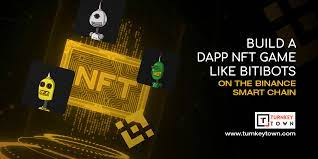
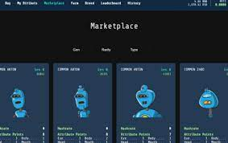

Bitibots 是一款 NFT 游戏，您可以在其中构建、繁殖和交易您的 bitibots。 找到一对完美的 bitibot，并用它们来培育下一代能够更快开采的 bitibot。

10.000 个独特的第 0 代 bitibot 正在等待为他们的新主人建造！

玩家可以购买、培育和交易具有收藏价值和独特 NFT 的 bitibots 的地方。培育具有最高采矿能力的终极比特机器人。在市场上交易或交易 p2p，为您的下一代获得完美的设置！BNB用于购买机器人，需要biti来培育它们。你能爬多高的排行榜？

