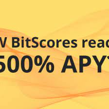
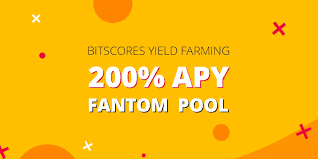

<strong>BitScores</strong> 是一个独特的 <strong>Yield Farming</strong> 项目，它将最高比例的农业与平等的社区声音相结合，以做出关键决策。

BitScores &nbsp;汇集了 DeFi 和去中心化技术必须提供的最佳优势：平等的准入门槛、民主治理、永久的 &nbsp;网络效应和经济理论。

该项目的一个独特功能是<strong>AMM 智能交易</strong>，它允许您通过<strong>以相同的形式</strong> 交易代币来增加代币的数量，而代币被接受质押。 因此，投资者无需担心接收、存储和转换 LP 代币。

所有存款、取款和接收奖励的功能都是完全透明的，并在ERC-20合约中实现。

