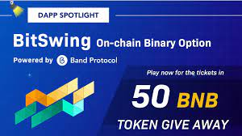
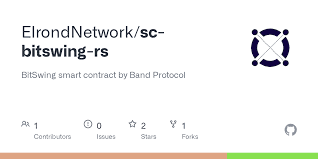

BitSwing 是用于二元期权交易的去中心化应用程序。 BitSwing 模仿二元期权经纪公司，用户可以在其短期市场预测中做多或做空。 二元期权——一种更像是一种预测的投资，可以是对也可以是错的，但不能介于两者之间。

首先，您需要做的就是安装Metamask或任何在 Kovan 测试网上运行的类似 Web 3 钱包。

用户将被要求在 ETH 中建仓，预测一分钟后 BTC 的价格是高于还是低于 Band 去中心化预言机确定的现货价格。我们的预言机将使用来自多个测试网数据提供商报告的中位数价格，以每秒实时更新的形式进行。虽然这仍在测试网中，但它展示了 Band Protocol 的真实用例，并展示了去中心化网络的潜在价值。

获胜者的 ETH 将翻倍，而失败者将失去他们的初始投注金额。

