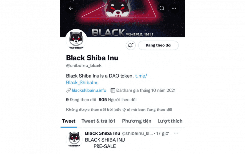

.png)

- Black Shiba Inu 是 DAO 代币。 持有#BSHIBA的用户将能够就项目的未来发展路线图发表意见并亲自投票。 &nbsp;

- 代币经济学：&nbsp;

1,000,000,000,000 总供应量 &nbsp;

30% 燃烧 &nbsp;

35% Cake-LP 锁定 1 年 &nbsp;

25% 预售 &nbsp;

5% 钱包开发 &nbsp;

5% 钱包营销&nbsp;

&nbsp;- 税收买卖：下滑 10%&nbsp;

5% 钱包夹 $BSHIBA &nbsp;

5% 流动性

