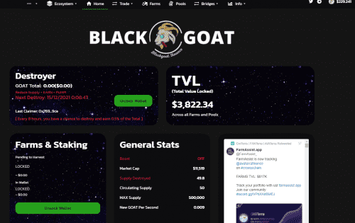
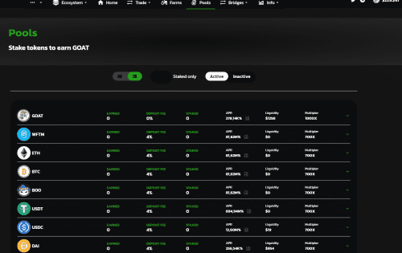

Fantom Network 中革命性的 DeFi 平台，下一代去中心化金融 (DeFi) 和农业收益应用程序，建立在高收益特性之上，我们确保收益的初始策略是使用不同的工具（破坏供应、提高奖励等）。 . ) 为代币持有者带来稳定的收益和被动收入。

## 可持续的多链战略

从种种迹象来看，目前的分层农业协议正在长期使用，因为大多数农场在头两天后都在苦苦挣扎，即使是 KYC、审计和大量营销项目现在也不能免于这种混乱。

作为一个团队，我们进行了多项研究，研究了过去几个月探索的许多策略，我们的结论催生了一种全新的方法来应对这种威胁，称为PLATETECTONIC！简单的说; 通过持有**AVATERRA 或 FANTERRA** **LP在我们的下一个链上筹集投资者资金，分配名额有限的私人销售**

