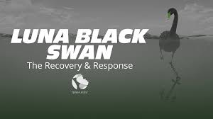
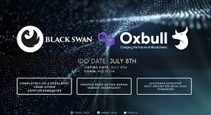

加密货币市场高度相关且充满下行尾部风险。 尽管有许多代币在这些时期竞相实现最高的正增长，但几乎没有一个项目计划在市场周期中出现相反的极端收缩。

Blackswan 不仅在市场增长周期保持稳定，而且在市场紧缩时期释放增长，旨在成为抗脆弱资产或不确定性指数。

在 Blackswan 生态系统中，您会发现创新产品和独特的质押机会。

**为什么当高于均衡流动性时 Blackswan 代币的供应会增加？**

无论代币的高流动性导致的稳定性如何，$SWAN 的供应在高流动性期间都会增加，以激励代币的增长。价格可能难以大幅波动，因此供应扩张有助于补充市值增长和用户财富。您可以通过参与 Blackswan Lake 来获得这种供应增长。

**参加黑天鹅湖有什么风险？**

为了参与 Blackswan Lake，您必须向 SWAN/USDC Quickswap 对提供流动性。这意味着您将获得在 Quickswap DEX 上累积交易费用的好处，尽管您也面临着无常损失。这意味着在高波动期间，您的代币持有量可能会减少，但是来自 Blackswan Lake 的奖励和激励应该足以弥补这一点。此外，由于 Blackswan 固有的高流动性，波动性应该很小。

