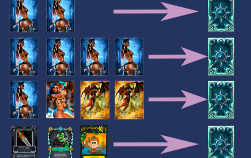
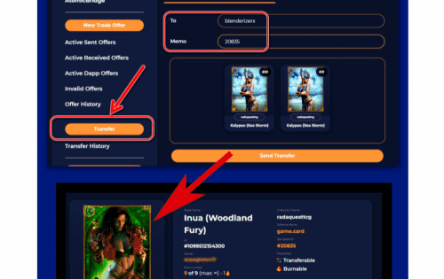

Blenderizer 为您的 NFT 收藏增添了一层新的乐趣。 为您的混合物定义成分，并为您的客户提供惊人的新资产，以换取烧掉旧资产。

借助这个系统，您可以在减少流通中的 NFT 数量并通过稀缺性增加其价值的同时，激发对您的收藏的更多兴趣。

## 介绍

到目前为止，没有人怀疑 NFT 会继续存在，但会保持非常高的水平！每天，新游戏都在通过将资产所有权移交给玩家来增加其资产的代币化。也有越来越多的艺术家通过 NFT 代币以数字格式分发他们的作品，这要归功于他们的数字签名系统确保了他们的真实性。

数字资产的收集者和交易者在采用这种数字主流方面发挥着关键作用。没有他们，这是不可能的，市场成交量正在稳步增长。这些投资者对数字资产收购和交易的信心清楚地表明了市场的走向。或者至少是需要注意的最重要的方向之一。

在其他文章中，我们一直在分析用于在 WAX 区块链上创建和管理资产的 SimpleAssets 智能合约。正如我们所见，它是一个非常完整的智能合约，允许我们创建和管理任何类型的资产；可替代代币（FT）、不可替代代币（NFT）和不可转让代币（NTT）。它是在 WAX 区块链上开发视频游戏的理想智能合约，因为它涵盖了游戏资产数字化的所有必要方面。

## 原子资产

WAX 上数字资产数字化生态系统的另一个关键参与者是 AtomicAsset，这是来自区块链生产商 Pink Network 的智能合约。

虽然 SimpleAssets 是代币的全能者，但 AtomicAssets 是 NFT sybarite，因为它目前只支持这种类型的代币，但以一种非常详细和高效的方式。插画家、音乐家、动画师等数字内容创作者将在此智能合约中发现一个非常强大且通用的工具，可以独立或收藏他们的创作。

Pink Network 的开发团队在促进创建和维护数字资产的任务以及为它们创建不同的监控工具方面做得非常出色。