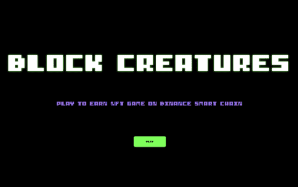
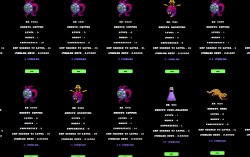

Block Creature 是 @wizard_devv 在 Binance Smart Chain 上开发的一款新的 Play 2 Earn NFT 游戏。 游戏以收集生物为中心， 训练他们赚取我们的游戏内奖励代币 $MOOLAH。 所有游戏项目和 角色是可交易的 ERC721 代币，可以在第三方市场上交易。

### 随机 NFT 生成

7 种不同的可能稀有度

结合曲线上的铸币价格上涨

$MOOLAH 烧成新币

### $MOOLAH = 游戏货币

玩赚模特

训练赚取更多MOOLAH

### 通电系统

7个可以随机铸造的道具

使用电源来增加收入

向其他用户交易通电

