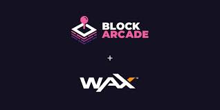
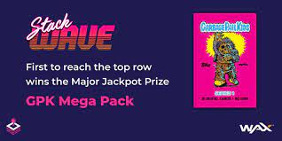

我们使用 BlockArcade 的目标是在去中心化网络上模拟传统的街机体验！ 这一愿景包括使用 WAX 的街机代币、使用称为 TIX 的自定义代币的奖品门票，以及用于消费门票的奖品柜台！ BlockArcade 是一个具有构建和交付最终用户应用程序经验的企业家团队。

BlockArcade的目标是去中心化网络上模拟传统的街机体验！BlockArcade团队，在构建应用程序方面经验丰富。 过去，我们使用Node.js，React / Redux，Electron，Go，C / C ++，WebAssembly和WordPress来构建应用程序。