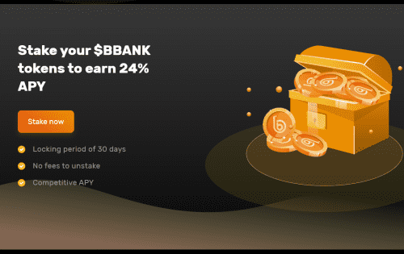
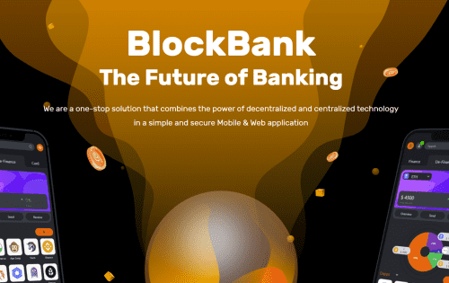

<strong>CeFi</strong> <strong>DeFi</strong> <strong>银行业务</strong> <strong>Robo-Advisory</strong>

托管钱包将服务于许多不同的目的，例如质押、存储资产、通过 API 交易到 CEX、为资产提供保险、借贷、法币开/关（链下/链上）以及 KYC/AML

非托管钱包将提供 WEB3 浏览器，支持多资产链（ERC、BSC、HECO 等），允许用户使用跨链交换轻松转移资金。 法币开/关坡道

通过采用最先进的技术，这为我们的用户提供了 Neobanking 体验，从而能够创建活跃的银行账户、信用卡/借记卡和 客户支持

想象一下您的个人财务顾问会了解您的习惯和习惯 相应地提出建议。 从信息资源发展到完成自主交易和农业。

