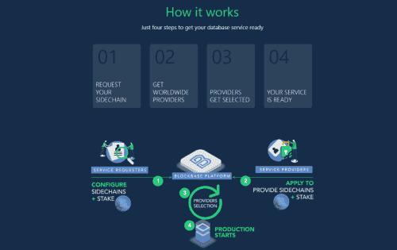
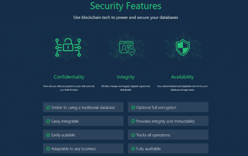

数据库不安全。 数十亿条记录被盗、暗中更改或永远丢失。 BlockBase 通过设计以完整性、不变性、可问责性、可审计性、可用性来保护您的数据。 这些品质将成为未来的常态。

## 探索 BlockBase

### 在这里找到开始使用 BlockBase 所需的所有信息

BlockBase 使用区块链技术提供安全、分布式的数据库存储服务。它将侧链上的数据库操作存储到 EOS 主链上，通过 EOS 上的智能合约进行管理。要了解有关 BlockBase 工作原理的更多信息，请查看下面 GitHub 上的文档。

为了使用 BlockBase 的软件，您必须运行 BlockBase 节点。BlockBase 节点 API 为服务请求者（希望使用该服务存储其数据库的人）和服务提供者（希望提供服务的人）提供所有功能。

当前的 BlockBase 软件版本在 EOS 网络上作为测试版运行。单击下面的网络跟踪器，以发现当前在那里运行的内容。