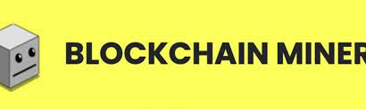
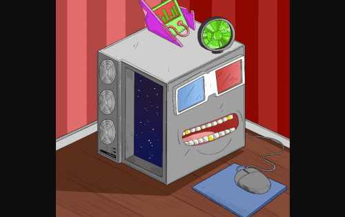

---
title: "Blockchain Miners Club Official"
description: "欢迎来到区块链矿工俱乐部 🤖 第一个 NFT 获得比特币挖矿奖励 📈 顶尖艺术 🎨"
date: 2022-08-10T00:00:00+08:00
lastmod: 2022-08-10T00:00:00+08:00
draft: false
authors: ["crazyxuanshao"]
featuredImage: "blockchain-miners-club-official.png"
tags: ["Collectibles","Blockchain Miners Club Official"]
categories: ["nfts"]
nfts: ["Collectibles"]
blockchain: "ETH"
website: "https://www.blockchainminers.club/?utm_source=DappRadar&utm_medium=deeplink&utm_campaign=visit-website"
twitter: "https://twitter.com/BMC_NFT"
discord: "https://discord.com/invite/blockchainminers"
telegram: ""
github: ""
youtube: ""
twitch: ""
facebook: ""
instagram: "https://www.instagram.com/BMC_NFT/"
reddit: ""
medium: ""
steam: ""
gitbook: ""
googleplay: ""
appstore: ""
status: "Live"
weight: 
lightgallery: true
toc: true
pinned: false
recommend: false
recommend1: false
---

区块链矿工 NFT 是手绘、稀有且独特的艺术品，具有真正的实用性。 我们独特的艺术品受到 BTC 矿工（Antminer S19j ASIC Pro）的启发，将限制在 11,111 件由 280 多个特征和属性生成的项目

# 什么是区块链矿工俱乐部™？

BMC 的使命是通过为 NFT 空间带来实用性并允许我们的俱乐部成员独家访问加密货币挖矿来降低进入加密货币挖矿的门槛。

# 奖励

区块链矿工俱乐部使用 BTC 矿工来产生社区奖励。开采的比特币 + 一部分二级销售每月都会添加到我们的奖励基金中，持有者可以投票决定他们如何使用奖励。自 2021 年 12 月 1 日起，奖励超过 60 万美元

