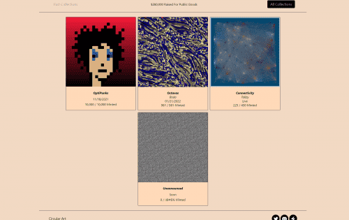
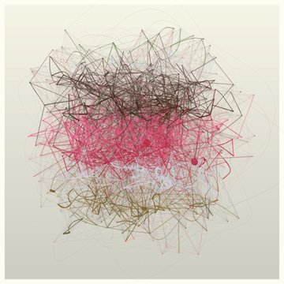

Circular Art 是一个生成艺术平台，旨在以可持续方式资助公共产品，同时为艺术家提供一个茁壮成长的平台。 关于乐观

哇！连接方式

[@CryptoTallzy](https://twitter.com/CryptoTallzy)

完全铸造！450/450 这意味着总计 28,125 美元用于乌克兰的救济。超级酷，看到

[@optimismPBC](https://twitter.com/optimismPBC)

NFT 社区支持艺术家并资助公共产品！更多酷的东西即将推出......很快......很快......