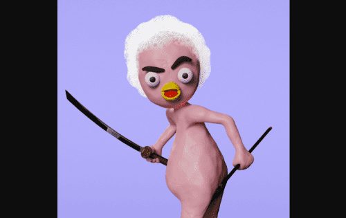
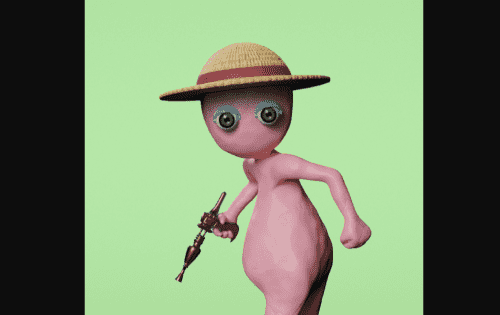

---
title: "Claylings"
description: "4040 只粘土人从他们的雕塑家的家中跑出来，直接进入虚拟世界，远离现实。你能抓住一个吗?"
date: 2022-08-15T00:00:00+08:00
lastmod: 2022-08-15T00:00:00+08:00
draft: false
authors: ["crazyxuanshao"]
featuredImage: "claylings.png"
tags: ["Collectibles","Claylings"]
categories: ["nfts"]
nfts: ["Collectibles"]
blockchain: "ETH"
website: "https://claylings.io/?utm_source=DappRadar&utm_medium=deeplink&utm_campaign=visit-website"
twitter: "https://twitter.com/0xclaylings?lang=en"
discord: ""
telegram: ""
github: ""
youtube: ""
twitch: ""
facebook: ""
instagram: "https://www.instagram.com/ClaylingsNFT/"
reddit: "https://discord.com/invite/claylings"
medium: ""
steam: ""
gitbook: ""
googleplay: ""
appstore: ""
status: "Live"
weight: 
lightgallery: true
toc: true
pinned: false
recommend: false
recommend1: false

---

Claylings 是一个 4,040 版的生成艺术项目，其美学灵感来自于 Chicken Run、Wallace 等。 Grommit or Neverhood，唤起 90 年代的怀旧情怀。

正在制作的短片

**如何获得 Clayliens 的白名单？**

8080 Clayliens 保留给 Claylings 持有者（每个 Claylings 持有 2 个薄荷糖）。 剩余的 WL 名额将赠送给其他项目的社区。