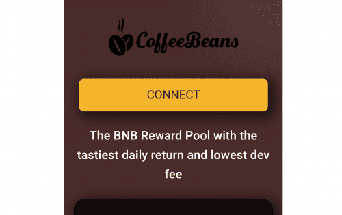
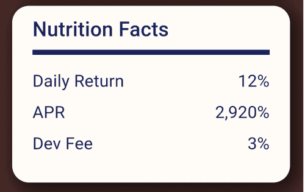

咖啡豆的价格是多少？

咖啡豆没有固定价格。每 BNB 的 TVL 越高，咖啡豆越多，TVL 越低，咖啡豆越少。这创造了公平的竞争环境，因此没有用户可以迟到。没有可用的计算器来计算。

我的每日百分比是多少？

每日百分比高达 12% 这取决于饮酒习惯，一天中你重新冲泡的时间或存款和 TVL 波动。平均每日回报率为 6-10%。

为什么我的奖励没有增长？

饮酒习惯影响奖励，您每天饮酒的百分比下降很多。如果您只是从少量存款开始，则需要时间才能显示在 dApp 上。仅保留 3 位小数。 TVL 每日增加会导致每日百分比降低。

如果我总是喝酒会发生什么？

如果你总是喝酒，你的每日百分比会急剧下降，并且不会获得最高的每日回报。这是防止鲸鱼耗尽 TVL 的反鲸机制。

每天 2 次或 3 次重复冲泡更好吗？

重新冲泡与复合。所以基本上是的。您需要为每次重新制作支付标准的 BSC 汽油费。

