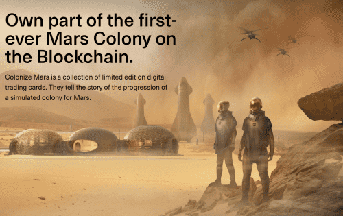
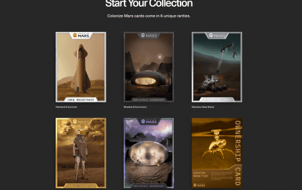

<strong>购买补给箱</strong>

供应箱是 NFT 包，包含数字交易卡。 卡片以殖民地所需的不同车辆、设备、建筑物和宇航员为特色。

<strong>使用卡片赚取玛蒂亚代币</strong>

Martia Token 是管理火星经济的游戏内代币。 通过激活你的卡片来对抗殖民地地图上的物品来获得它。

<strong>明智地选择</strong>

所有者有机会设定费用并描述他们的物品的独特之处。 选择最佳所有者以最大化您的游戏内收入。

<strong>登上排行榜</strong>

跟踪您在其他玩家中的排名。 竞争成为最高收入者、最高收藏家等等！

<strong>创建终极收藏</strong>

在一个地方查看您的卡片、补丁、贴纸和其他 Colonize Mars NFT 收藏品。

