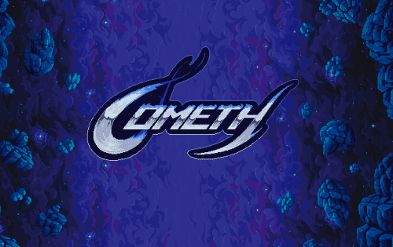

征服区块链空间

Cometh 通过利用区块链的独特功能来促进娱乐并提出通往 Web3 的最佳网关来进行创新。

在 2021 年 2 月部署游戏的第一个版本后，Cometh 迅速成为最活跃的区块链游戏。

来战

Cometh Battle 是具有公平玩家中心经济学的下一代区块链游戏。 该游戏可以免费玩，也可以拥有。 玩家根据他们的牌组使用策略参与银河战斗。 这些卡不是由 Cometh 出售的，而是由玩家使用他们从赢得战斗中囤积的资源以及 DeFi 协议中可用的代币制作的。 Cometh 组织锦标赛和锦标赛来支持社区并支持电子竞技活动

