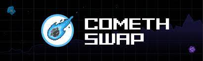
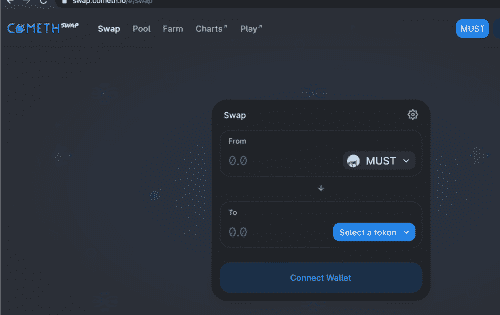

---
title: "ComethSwap"
description: "ComethSwap 是一个开放的 DEX，任何人都可以在其中列出与 ERC20 兼容的配对"
date: 2022-08-15T00:00:00+08:00
lastmod: 2022-08-15T00:00:00+08:00
draft: false
authors: ["crazyxuanshao"]
featuredImage: "comethswap.png"
tags: ["Exchanges","ComethSwap"]
categories: ["nfts"]
nfts: ["Exchanges"]
blockchain: "Polygon"
website: "https://swap.cometh.io/?utm_source=DappRadar&utm_medium=deeplink&utm_campaign=visit-website#/swap"
twitter: "https://twitter.com/MUSTCometh"
discord: "https://discord.gg/TRBzkzRk"
telegram: "https://t.me/cometh_io"
github: "https://github.com/cometh-game/comethswap"
youtube: ""
twitch: ""
facebook: ""
instagram: ""
reddit: "https://www.reddit.com/r/cometh/"
medium: "https://medium.com/cometh"
steam: ""
gitbook: ""
googleplay: ""
appstore: ""
status: "Live"
weight: 
lightgallery: true
toc: true
pinned: false
recommend: false
recommend1: false

---

<strong>ComethSwap </strong>是一个开放的 DEX，任何人都可以在其中列出 ERC20 兼容对。 为了吸引 Comethswap 的流动性，将激励特定的 DeFi 相关池。 流动性提供者将在没有归属的情况下分配必须⚗️代币。 Comethswap 上可供交易的代币池和列表将快速而稳定地增长。

## 征服 区块链空间

Cometh 通过利用区块链的独特功能
来促进娱乐并提出通往 Web3 的最佳网关来进行创新。
凭借 2021 年 2 月部署的第一版游戏，
Cometh 迅速成为最活跃的区块链游戏

