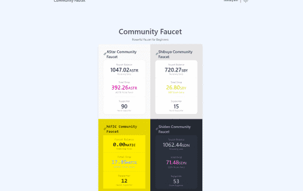

非官方多链水龙头

由志愿者支持组成，NFT 分发给支持者。

### 什么是水龙头？

它免费为您提供几倍的天然气成本。
就像水龙头里的水一样。

### 什么是 AStar 社区水龙头？

官方提供的水龙头经常坏，但对初学者来说很重要。
因此，它被创建为官方水龙头的替代品。
此外，这款水龙头的 ASTR|SDN 溢出量是官方水龙头的 10 倍。

### 支持者 NFT

水龙头依赖于志愿者的支持。
作为对他们支持的回报，我们给他们一个 NFT 作为支持证明。
如果您是 Faucet 用户并且认识拥有 NFT 的人，请表示感谢。

