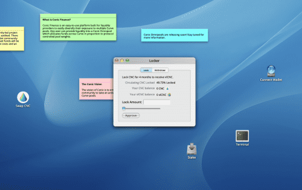
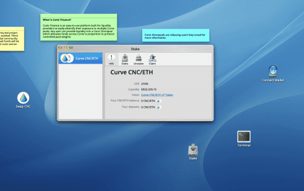

Conic Finance 是一个易于使用的平台，可让流动性提供者分散对多个 Curve 池的风险敞口。 Omnipools 为 Conic 提供了便利，Omnipools 将流动性分配给多个 Curve 池中的一项资产。 Conic 的主要目的是创建 Curve 流动性的有效再平衡。 通常用户必须在矿池之间手动转移资金（同时在此过程中会产生高昂的汽油费），而 Conic 会自动完成此操作，并使社区能够决定应如何分配流动性。

Conic 治理代币 (CNC) 可用于对协议参数进行投票，并可通过在平台上提供流动性来赚取。 通过治理，CNC 持有者可以控制池权重并添加新池，控制 Curve Finance 上的流动性分配，并提出协议更改。

