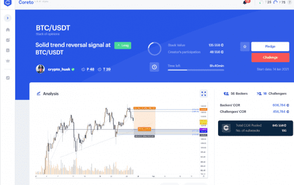

---
title: "Coreto"
description: "Coreto 是一个基于声誉的加密研究平台； 建立一个基于声誉、共享知识和可验证事实的更安全的生态系统。"
date: 2022-08-15T00:00:00+08:00
lastmod: 2022-08-15T00:00:00+08:00
draft: false
authors: ["crazyxuanshao"]
featuredImage: "coreto.png"
tags: ["Social","Coreto"]
categories: ["nfts"]
nfts: ["Social"]
blockchain: ""
website: "https://www.coreto.io/?utm_source=DappRadar&utm_medium=deeplink&utm_campaign=visit-website"
twitter: "https://twitter.com/Coretoio"
discord: ""
telegram: "https://t.me/Coreto"
github: ""
youtube: "https://www.youtube.com/c/Coreto"
twitch: ""
facebook: "https://www.facebook.com/coreto.io"
instagram: "https://instagram.com/coretoio"
reddit: "https://www.reddit.com/r/Coreto/"
medium: ""
steam: ""
gitbook: ""
googleplay: ""
appstore: ""
status: "Live"
weight: 
lightgallery: true
toc: true
pinned: false
recommend: false
recommend1: false
---

Coreto 是一个基于声誉的加密社交平台，它连接了项目、散户投资者和影响者之间的互动，所有这些都基于一个全面的信任系统。 从本质上讲，它是一个利用区块链技术和独特的信任和性能算法的平台，以便用户在确定内容创建者的性能和可信度时可以依赖。

Coreto 的愿景是团结区块链社区。 通过使用经验丰富的社区成员的累积意见，人们将更好地了解区块链项目的目标和方式，帮助他们做出更明智的投资决策。

## 下一个重大里程碑

### 主要饲料升级

我们最新的设计更改为每位 Coreto 用户带来了有益的更新，包括最好的 Staking of Opinions Pools，以及令人难以置信的进步和 Main Feed 的新外观

## 快捷功能

### 名声

一个大胆的区别：使用区块链技术和机器学习来构建更安全的加密生态系统。

### 货币化

完整的收入流：创造、发展和货币化所需的一切。

### 项目曝光

加密项目建立品牌知名度和社区的终极工具。

### 升级

感受我们游戏化机制的快感，同时创造高质量的内容。

