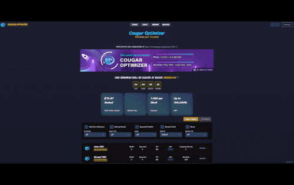
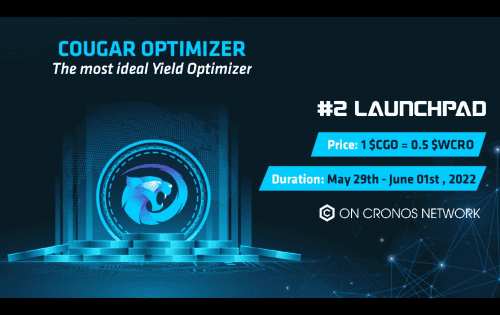

cougar 优化器旨在基于复利的力量优化 DeFi 用户的利润，节省用户时间，并通过创造性的自动化、最佳的复利频率和高效的气体利用来实现更高的收益。 这有多棒？ 与其他农场相比，您在我们这里耕种可以节省费用！

# 什么是产量优化器？

收益优化器是一种自动化服务，旨在获得加密投资的最大可能回报，比尝试通过手动方式最大化收益更有效。每个金库都有自己独特的农业策略，通常涉及对存入流动资金池的加密资产进行再投资。在最简单的层面上，它从质押资产中获得奖励并将其重新投资回流动资金池。这会增加收到的利息金额，并增加收益所基于的质押金额。产量优化器每天可以重复此处理多达数千次。这种相当简单的方法是在 Cougar Optimizer 上发现大量 APY 的主要原因。复利费用在所有参与者之间摊销，对用户来说更便宜。

**CGO Finance如何使您的利润翻倍？**

- 您可以像其他收益农业一样获得 CGO 代币奖励
- 您的质押资产通过我们的智能复利机制不断增加（将利润再投资于您的质押资产，我们称之为优化器）
- 您通过在每个自动池中执行复合交易来收集复合赏金令牌