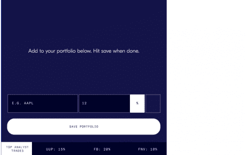
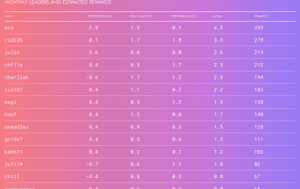

通过创建股票、etf 或加密创意的虚拟投资组合来加入 covey。学习、竞争和分享您的实时投资组合的对冲基金级别数据！每个月底，Covey 都会用代表社区数据库价值份额的代币奖励分析师。&nbsp;

最好的投资分析师不会管理我们的资金。有很多人才想成为投资经理，但除非他们去“正确”的学校或拥有“正确”的人脉，否则很难推出基金。另一方面，散户投资者希望接触到优秀的基金经理，但由于最低要求很高，他们被排除在对冲基金之外，而且由于历史业绩不佳和缺乏创新，他们不信任共同基金。

为了寻找下一位伟大的运动员，我们周游世界、花费数百万美元并依靠数据。让我们这样做，寻找下一个伟大的经理，让任何人都可以效仿，为更多人带来更高的回报。

Covey 正在为投资带来一种透明、由同行推动且无风险的方法。

# 加入我们 的顶级分析师社区。

提升您的投资水平和我们社区的水平

免费、无风险、模拟投资组合。

每走一步都能获得奖励。

在几分钟内建立您的免费虚拟投资组合。

**通过对冲基金交易界面轻松上手。**

交易股票、ETF 和加密货币。

没有前期财务承诺。

**分享、竞争和优化您的策略。**

实时市场视图和记分牌。

排名由唯一重要的衡量标准 - 性能。

学习并提升自己的投资策略

**参与和赚取。**

加入和创建投资组合 = 奖励。

与您的社区分享 = 奖励。

表现最佳的投资组合 = 奖励。

**在顶部固定一个位置。**

无限的盈利潜力。

Covey's 的资金经理

复制交易应用程序

即将于 2022 年秋季上市。

