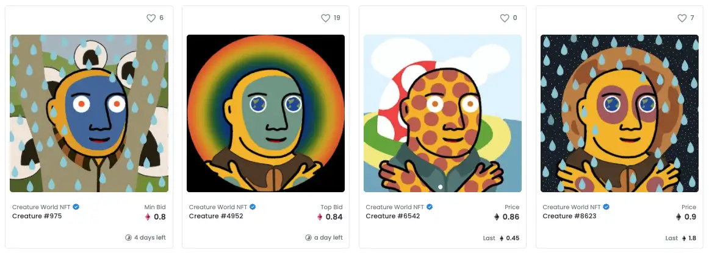
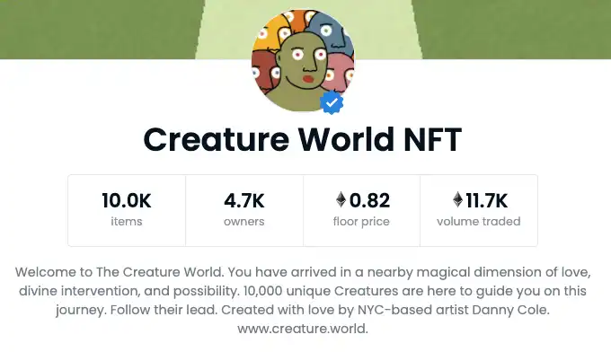

欢迎来到生物世界。 你已经到达了附近一个充满爱、神圣干预和可能性的神奇维度。 10,000 种独特的生物在这里引导您踏上这段旅程。 跟随他们的脚步。&nbsp;

# 什么是生物世界 NFT？

“生物世界是我喜欢参观的这个虚构的地方，我想给其他人参观的机会。进入那些另类的状态是一种真正的美，就像做梦一样。” —— 丹尼·科尔，创作者 

Creature World NFT 是 10,000 个生物的集合，其灵感来自 Cole 的物理 Creature World 绘画，这些绘画具有独特的特征，包括不同的背景、生物设计、装饰、眼睛、前景、嘴巴、服装

值得注意的是，Cole 在 The Creature NFT Discord 小组中宣布，他对包含的特征非常有意识，并允许特征组合，以保持每个输出“看起来像是通向完全组合世界的窗口”。 

由此产生的艺术是他建立一个乌托邦世界的愿景的延续，据说他正在“围绕描绘想象的世界建立职业”。NFT 和元宇宙是他实现愿景的完美背景。甚至在 Creature World网站上也有这个元节的开始。

