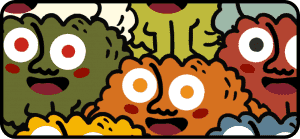
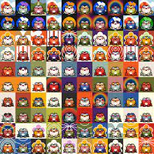

---
title: "CreatureToadz"
description: "当一个生物和一只蟾蜍被留在钱包里太久了🐸❤️"
date: 2022-08-15T00:00:00+08:00
lastmod: 2022-08-15T00:00:00+08:00
draft: false
authors: ["crazyxuanshao"]
featuredImage: "creaturetoadz.png"
tags: ["Collectibles","CreatureToadz"]
categories: ["nfts"]
nfts: ["Collectibles"]
blockchain: "ETH"
website: "https://creaturetoadz.com/?utm_source=DappRadar&utm_medium=deeplink&utm_campaign=visit-website"
twitter: "https://twitter.com/creaturetoadz"
discord: "https://discord.com/invite/K5kfXsmDxh"
telegram: ""
github: ""
youtube: ""
twitch: ""
facebook: ""
instagram: ""
reddit: ""
medium: ""
steam: ""
gitbook: ""
googleplay: ""
appstore: ""
status: "Live"
weight: 
lightgallery: true
toc: true
pinned: false
recommend: false
recommend1: false

---

CreatureToadz 是 Creatures 和 CryptoToadz 这两个独立成功的 NFT 社区之间的第一个交叉项目。 艺术是从头开始制作的，以确保两者之间*完美*的风格结合。 不遗余力，我倾注了我的灵魂，将这些物种聚集在一起。

**CreatureToadz 新网站正在建设中🐸！**

**很快回来！别发牢骚！**

