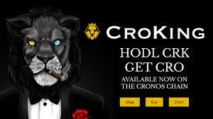

购买 CroKing (CRK) 并持有。 赚取CRO！ CroKing 使用 Cronos 平台代币 ($CRO) 向您付款。 相当于在以太坊链上赚取 ETH。 CRO 是 Cronos 链的平台代币，有无数的用例，其中最受欢迎的是强大的利息收益和非常受欢迎的带有多种持卡人福利的 crypto.com 借记卡。

roKing ($CRK) 是一种奖励代币，为持有 $CRK 支付 $CRO。

## 什么是 CRO？

CRO 是 Cosmos 上 Cronos EVM 链的平台代币，是crypto.com建立的平台代币。请查看crypto.com网站，了解持有和质押 CRO 的所有好处。

## CroKing 是如何工作的？

简单的！购买 CroKing (CRK) 并持有。赚取CRO！

## 我必须领取 CRO 奖励吗？

不会。CRO 奖励会自动存入您的钱包，作为 WCRO（包装 CRO）。有关将 WCRO 代币合约添加到您的钱包的信息，请参见下文。

## 我可以使用哪些钱包？

任何与 EVM 兼容的钱包都可以使用。最受欢迎的两个钱包是 MetaMask 和 Crypto.Com DeFI 钱包。

## 我需要买多少钱？

您必须在钱包中至少持有 75 亿 CRK 才能开始赚取 CRO 奖励。CRK 的当前价格可以在Crodex 和MM Finance交易所找到。

## 我将获得多少 CRO？

每笔 CRK 交易的 7% 分配给 CRO 奖励，按持仓比例分配给所有 CRK 持有者（只要您持有 75 亿 CRK 或更多）。获得的总奖励取决于交易量和 CRK 的价格。您持有的CRK越多，您获得的CRO奖励就越多！

