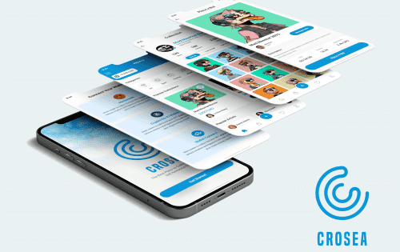
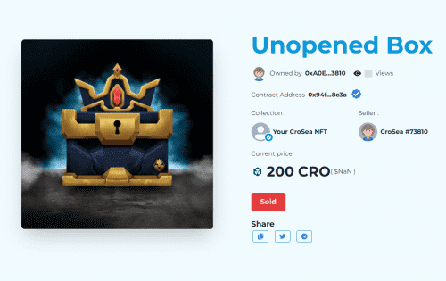

什么是&nbsp;Crosea？

Crosea 是在 Cronos 区块链上交易不可替代代币 (NFT) 的最大开放 nft 市场。 使用 CRO、Wrapped USDT 和任何 CRC20 代币，Cronos 社区可以与其他 NFT 爱好者和消费者进行点对点交易、买卖。 由于我们专注于允许用户虚拟查看他们拥有的任何 NFT，Crossea 在很短的时间内开创了很多，我们本质上是社区 NFT 查看器。 &nbsp;Crosea 不仅仅是一个 NFT 市场，它还为新的 NFT 艺术家提供了一个社交环境，能够从具有创建 NFT 功能的 Dapp 启动 NFT。 <strong>#CroFam</strong>

## 用 1 个 CRO 铸造你自己的 NFT

连接你的钱包来铸造你自己的 NFT。上传您的图片、命名、描述、添加可选的版税并立即铸造 NFT。您还可以在 CroSea 上出售您铸造的 NFT。

