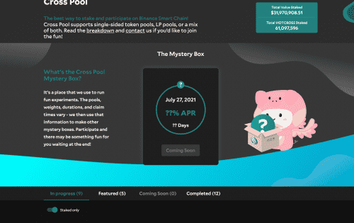
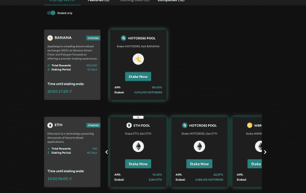

<strong>Cross Pool</strong> 是 Hot Cross 产品套件的成员，该产品套件提供了一种安全且去中心化的方式来奖励用户质押 LP 代币和单面传统 BEP20 代币。 该协议在技术上适用于各种 Staking 场景和任何 EVM 网络。 但是，在第一阶段，它将被用作分发新代币和奖励用户质押其他 LP 或 BEP20 代币的一种手段。 <strong>$HOTCROSS 代币本身将通过跨池进行部分分发。</strong>

# KYC 一次，永远访问

KYC'ing 是一次性活动。注册 0.0625 BNB，您将永远有资格参与我们所做的任何 Hot Cross IHO 和其他合规产品。感谢您参与 Hot Cross 平台！

