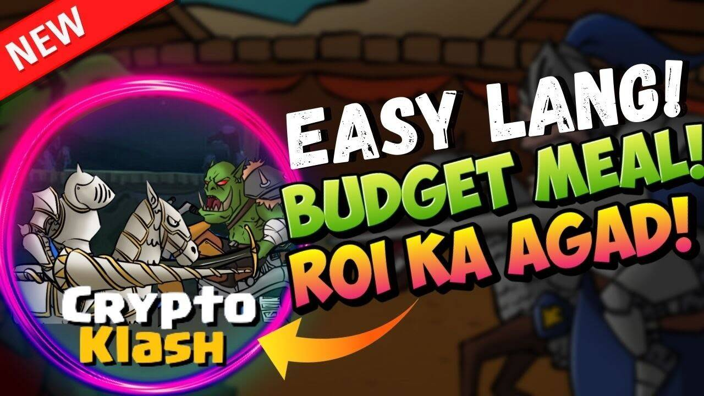

CryptoKlash 是一款 BSC P2E 游戏，灵感来自 Clash Royale，这是一款有趣而疯狂的游戏，拥有多彩的宇宙。

我们的游戏是 2D 设计的，并且已经有 3D 设计，将在未来几周内公布（我们所有的设计都是我们自己制作的（2D 和 3D）

Crypto Klash 由经验丰富的团队开发，游戏没有漏洞和漏洞，并且完全在 BSC 上，它仍然是 P2E 最常用的区块链。

我们是一款易玩的游戏，Crypto Klash 中只有一个 NFT

我们不使用 oracle，因为它是项目寿命的麻烦之源

我们还有一个土地系统，为他们的所有者创造被动收入，这是一种质押形式。

