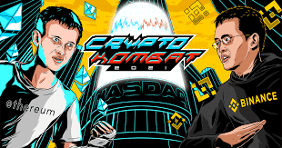

Crypto Kombat 是以太坊区块链上同类游戏中的第一款，战斗的英雄是来自加密空间的影响者、著名开发人员、加密项目的创建者、交易所和企业家！

KOMBAT 是内部游戏的代币。 KOMBAT 可以在交易所交易，也可以在 YeldFarming 中使用。&nbsp;

KOMBAT 可以通过合约质押以在 VOMBAT 中获得奖励。为了铸造您最喜欢的英雄的 NFT 卡，需要 VOBAT。每张加密英雄卡都有 4 个稀有级别 - 创世纪、史诗、稀有和普通。每个玩家可以通过累积所需数量的VOMBAT来接收最后三种类型。创世卡以一份副本发行，必须转让给其上所描绘的人。

Elon Musk、Pavel Durov、Charlie Lee、Vitalik Buterin 和其他数十位英雄在 Crypto Kombat 等着你！ Game Hero 卡可以在 OpenSea 市场上转让、交换或交易。

游戏玩法会让人想起经典的剪刀石头布，玩家将自己的英雄卡发送给其他玩家的卡，并通过比较智力，力量和影响力的特性，与一些随机因素的对手进行竞争。

加入日益活跃的 Crypto Kombat 社区！我们的目标是以有趣的方式告诉大家改变加密货币和区块链世界的人！

