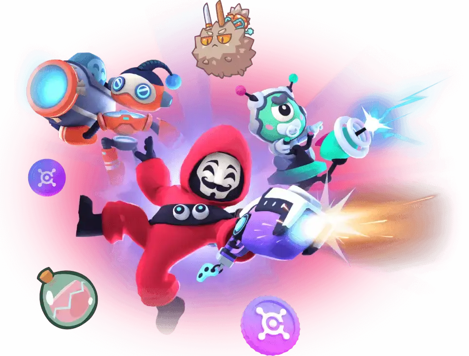

CMF DAO 是一个社区驱动的平台，通过奖励用户的参与和享受来赋予用户权力。通过使用创新的代币经济学，利用 Play 赚钱、网络、奖学金和 GameFi；同时还结合了 DeFi 和 NFT 的优点。

CMF DAO 是一个社区驱动的平台，通过奖励用户的参与和享受来赋予用户权力。通过使用创新的代币经济学，利用 Play 赚钱、网络、奖学金和 GameFi；同时还结合了 DeFi 和 NFT 的优点。

