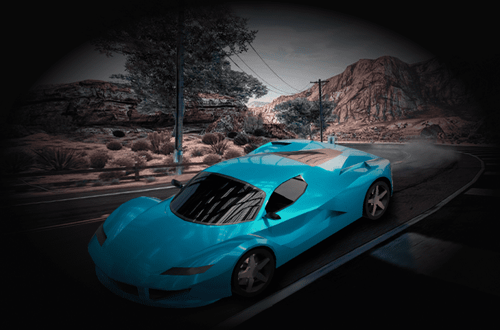

加密元汽车代币。

CMC 是 CRYPTO META CARS 代币的缩写。您可以在 P2P 模式下通过游泳池和耕作或赛车来赚取它。&nbsp;

在市场上，玩家可以买卖 NFT——汽车和汽车材料。获得经验值并升级您的汽车和车库。

Crypto Meta Cars (CMC) 是一种内部货币，用于登录游戏和购买游戏中的物品。购买车库池、燃料、罐头、泵、工具箱或门票。

参加 CMC 抽奖活动。借助 CMC 代币，您可以购买门票并试试运气。&nbsp;

奖金会立即分配给成功中奖彩票的持有者，因此无需前往当地售票亭领取奖品。

