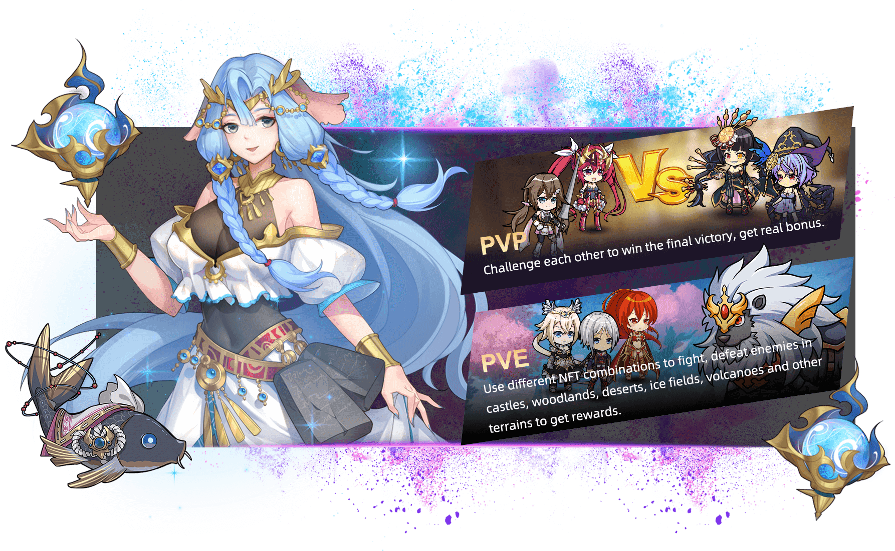

Crypto Nijigen 是一款基于收集、培养和对抗强大英雄的游戏。

Crypto Nijigen 英雄有不同的职业：战士、弓箭手、猎魔人、召唤师、总督、盗贼和一些传奇职业。玩家将通过小游戏、任务、竞赛和特殊的游戏内活动与他们的英雄互动并增强他们的能量。

Crypto Nijigen 使用以太坊区块链来确保公开、透明的所有权和流动、安全的市场。玩家对自己的英雄和装备拥有完全的所有权，并且能够顺利、安全地进行交易和出售。

