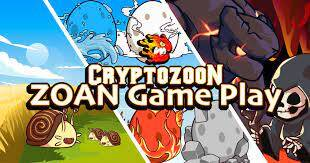

**CryptoZoon** 的灵感来自 Pokemon Story，我们的使命是建立一个数字怪物的综合平台，使数百万人能够以简单、创造性和愉快的方式参与 NFT 和基于区块链的游戏世界。**CryptoZoon** 将是第一个生态系统将游戏和数字收藏品的最大方面结合起来，将其转变为数字生物世界。有了 **CryptoZoon**，玩家可以使用他们的 ZOAN 来对抗怪物、收集、成长和参加训练（互相战斗）。

