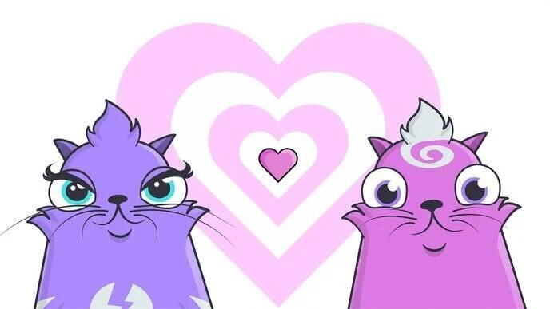

在 CryptoKitties 中，用户收集和繁殖我们称之为 CryptoKitties 的非常可爱的生物！每只小猫都有一个独特的基因组，定义了它的外观和特征。玩家可以通过繁殖他们的小猫来结交新的毛茸茸的朋友并解锁稀有猫咪。

CryptoKitties 是一款小猫繁殖和收集模拟器游戏，由以 CryptoKitties 为中心的以太坊区块链网络提供支持。拥有超过 127,000 名 CriptoKitty 持有者和 200 万只 CryptoKitties，这是一个庞大的生态系统。每只猫都归玩家所有，不能更换、带走或销毁：所有小猫都是 NFT 资产。

