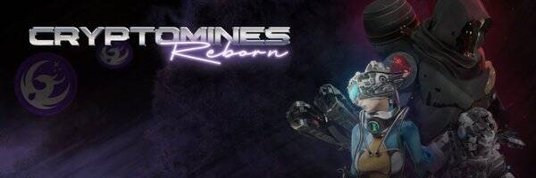

CryptoMines 的目标是成为区块链上最伟大的科幻游戏，同时让他们的用户享受成为广阔宇宙的一部分，享受战略游戏的快感，当然，还可以获得 $ETERNAL。
游戏部署在币安智能链上，兼容MetaMask等web3钱包，用于接受交易和支付gas费用。 MetaMask 可以作为浏览器扩展程序安装，也可以作为移动设备上的应用程序安装。
资产是按照 ERC-721 标准铸造的玩家拥有的 NFT，可以在我们的市场上交易或通过 P2P 将其出售给其他玩家。

