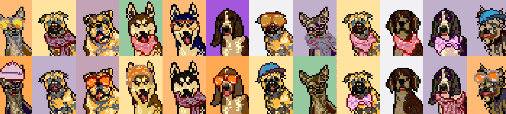

视觉艺术通过我们简单的拖放解决方案上传和销售您的视觉艺术作品作为 NFT。我们的市场将易于使用并以非常低的交易费用运作。音频 在我们的平台上，会有一个专门针对音乐家和音频发烧友的部分。我们将实施面向音乐家和音乐行业的独特功能。应用程序我们即将推出的智能手机应用程序将使任何人都可以通过手机创建和交易 NFT。 NFT 从未如此简单！ NFT Launchpad NFT Doggy 通过完全去中心化的代币拍卖为加密社区和即将到来的高潜力 NFT 项目赋能。 NFT DOGGY 社区成员可以质押 DOGGY 代币参与各种白名单、种子基金和私人销售活动，并支持他们最喜欢的 NFT 项目

NFT 市场生态系统。

