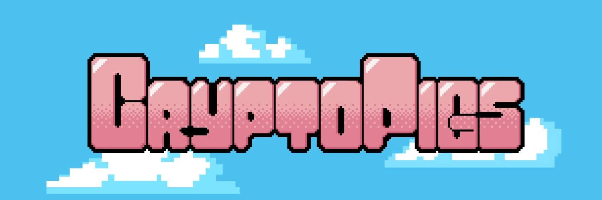

CryptoPigs 是 ONE 上由算法生成的、高度受限的 NFT。这些令人难以置信的 NFT 有 5000 个版本，并且在未来将游戏化、虚拟宠物机制、PvP（猪对猪）和 Freyala XYA 生态系统集成作为其游戏的一部分+NFT 环境 (https://world.freyala.com/) &nbsp;换句话说，这些不会是你的平均 NFT。您将能够与您的 Cryptopig 一起玩耍、照顾它并升级它，您对它的爱越多，它在战斗中的表现就越好！ PvP 系统虽然仍处于微调阶段，但将是剪刀石头布和口袋妖怪的结合体，并设有一个有奖品的竞争排行榜和一个升级系统。 &nbsp;Piggybank 的原生代币 COINK 将被整合到 NFT 游戏化经济中，作为一种资源来加速你的猪的成长，改变它的动作，获得某些有利的物品，作为与其他猪战斗的奖励和赌注等等。

