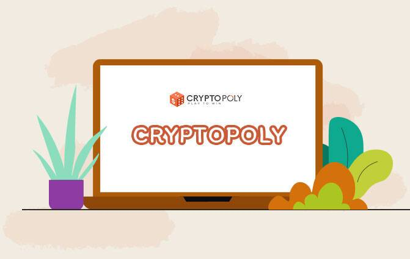

CryptoPoly 是一款受著名的大富翁游戏启发的赚取加密货币游戏。这是一场双赢的游戏，赢家将获得的利润直接记入他们的钱包。另一方面，失败者会收到 LEE 代币，用于在 CryptoPoly 用户之间分享利润。这样，没有人会空手而归。 Cryptopoly 在多边形网络上运行。

我们的游戏在多边形网络中的智能合约上运行。通过即时支付，获胜者可以直接在他们的电子钱包中获得奖品。如果您输了，CryptoPoly 将在游戏滚动期间使用 3x LEE 代币奖励您。 Cryptopoly 在 LEE 代币持有者之间分享所有游戏利润。

Cryptopoly 还可以让你通过拥有 16 种超级稀有和有限的 NFTS 中的任何一种来赚取被动收入。&nbsp;

