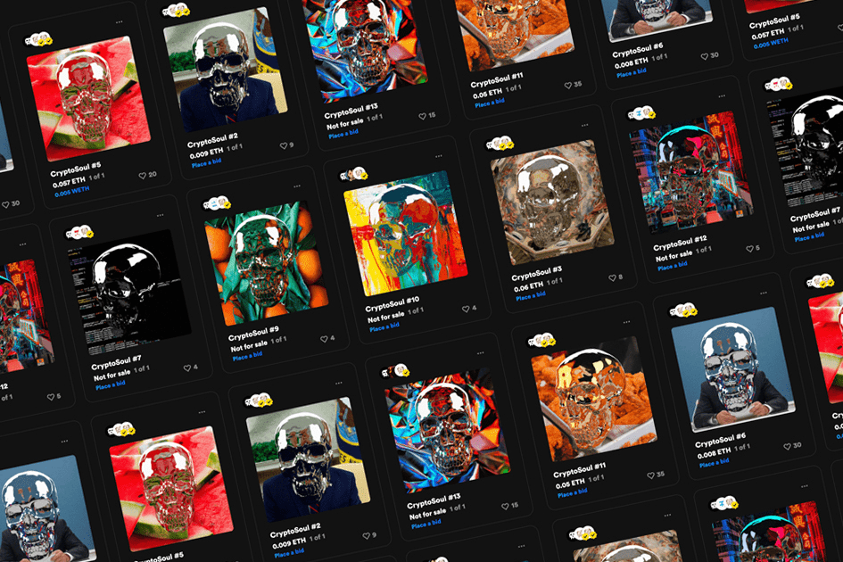

CryptoSouls 是存储在以太坊区块链上的 50 个可收藏的 ERC-1155 不可替代代币。每个 CryptoSoul 都是反映在线文化的独特动画图像。

今天的实时 CryptoSoul 价格为 0.000661 美元，24 小时交易量不可用。我们实时更新我们的灵魂到美元的价格。 CryptoSoul 在过去 24 小时内下跌了 23.20%。当前的 CoinMarketCap 排名为 #2025，实时市值为 211,553 美元。它的流通供应量为 319,927,334 SOUL 币，最大。供应不可用。

如果您想知道以当前价格在哪里购买 CryptoSoul，目前用于交易 CryptoSoul 股票的顶级加密货币交易所是 Hotbit 和 Mercatox。您可以在我们的加密交换页面上找到其他列表。

