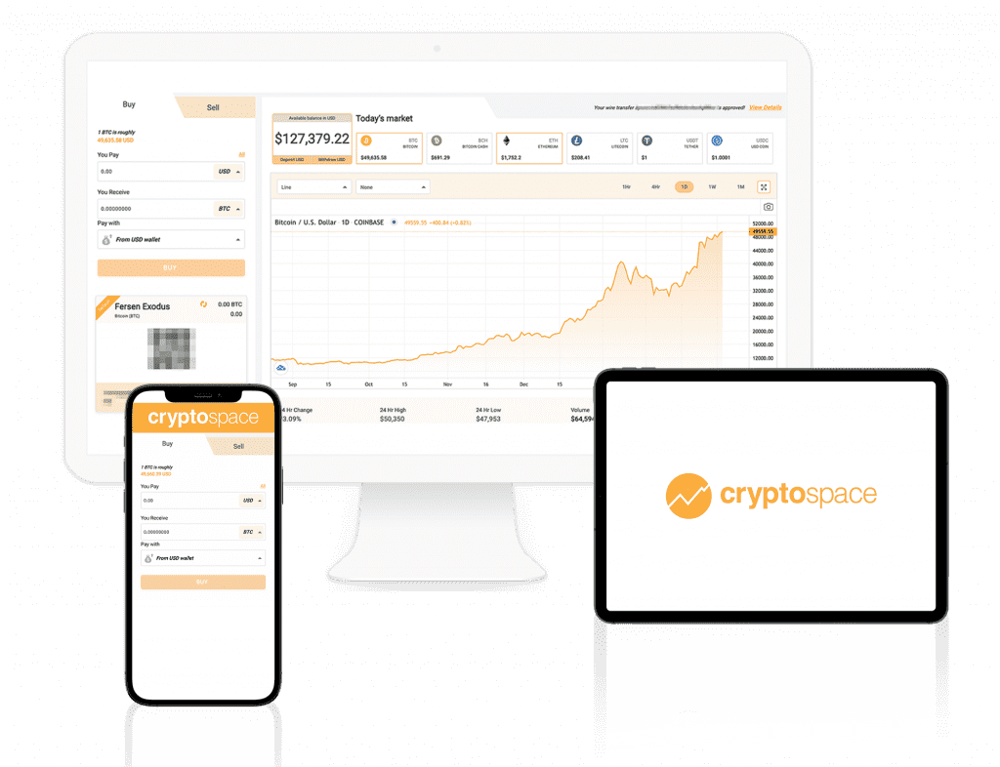

Cryptospace 是一个收益农业 dApp，它允许其用户将他们的代币锁定在池中（单一或多资产）并获得 CRY 代币作为奖励。该项目还将很快添加新功能，例如彩票、NFT、启动板等，这将为原生代币 (CRY) 提供额外的实用性，并有助于烧毁它以使其变得稀有。

立即直接购买加密货币到你的钱包。不再有冻结或黑客攻击的硬币。你是你财务命运的主人，该平台是实时的。我们提供快速的客户支持并欢迎您的反馈。

