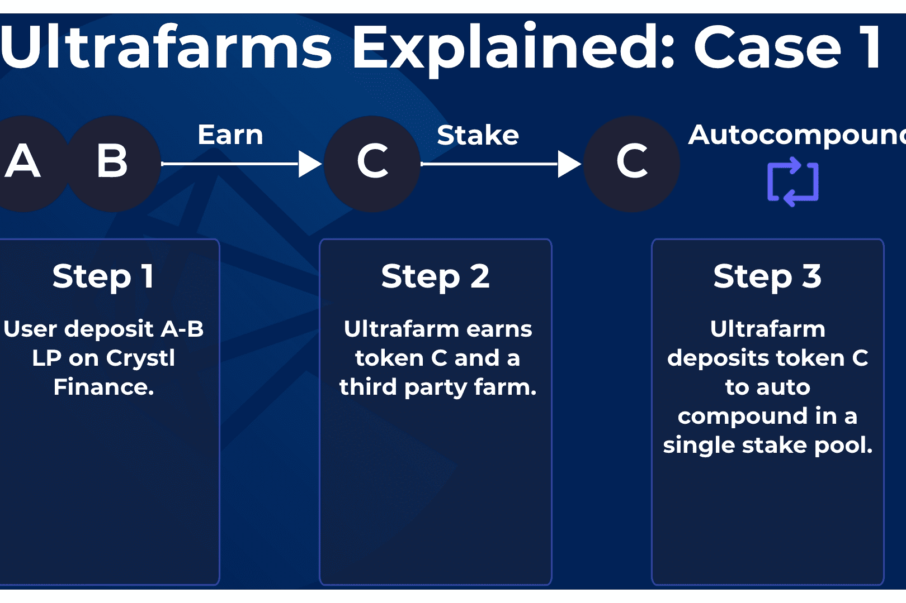

**安全&nbsp;贸易**
Crystl Finance 是 Polygon 和 Cronos 上的去中心化收益最大化工具。我们是 ApeSwap 的官方合作伙伴
由 Crystal Crew 打造，我们拥有一支致力于发展 Crystl 生态系统的专业团队。
特征

  使用高 APY 保险库以您的方式最大化被动收入
  $CRYSTL 治理代币，上限为 1250 万个代币
  合同和用例透明且安全
  来自 CryptEx 的低风险审计

