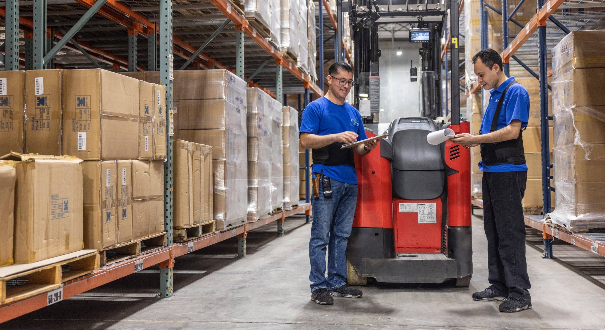

CSW 具有美元分红、动态 ARP 和 3 级推荐计划等创新功能。

CSW 具有美元分红、动态 ARP 和 3 级推荐计划等创新功能。预售期间筹集的所有加密货币构成项目的资金。每两天，项目预算的 5% 分配给 CSW 代币持有者。投资者持有的流动性越多，他获得的股息就越多。

我们关心我们的团队成员、我们经营所在的社区以及环境管理。凭借经验丰富、多元化和独立的董事会指导我们的领导团队，我们拥有不断提高标准并做得更多的愿景和精神。

