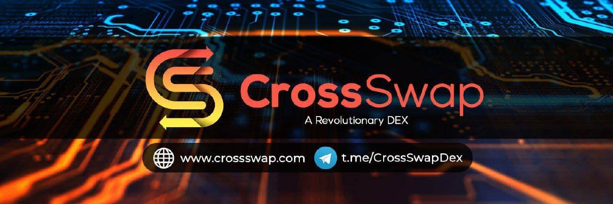

CSWAP 是一个高 APR 奖励的高收益农业平台
是什么让我们与众不同？
我们的团队确保我们的投资者和社区为购买 CSWAP 代币而支付的 5% 交易费用的一部分被用于资助这一新事业的目标，以拯救我们的海洋和生态系统。
为了确保为我们的投资者提供最好的服务，我们分配了 40% 的代币作为储备金，其中 10% 专门用于社区作为奖励和赠品。我们将利用剩余 30% 的代币来维护我们社区的整体利益，并提供投票选项，以便您的声音被听到并采取行动！
对 RUGDOC 和 TECH-RATE 的审核已完成！

