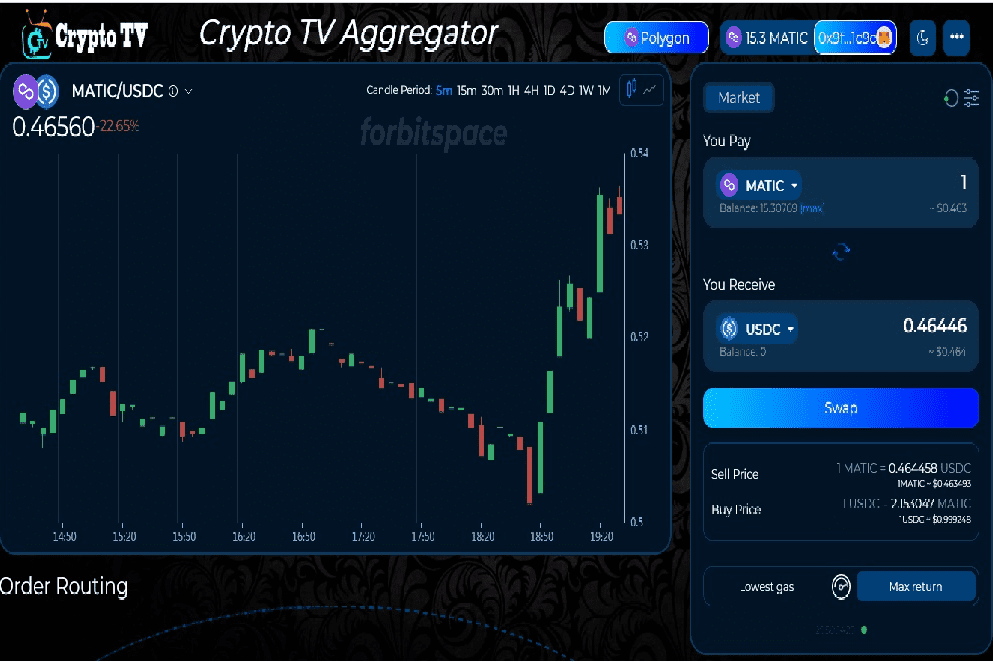

CTV DEX Aggregator 是一个专业的 DeFi 仪表板，将最流行的 DeFi 协议和区块链聚合在一个 dapp 中。 CTV DEX Aggregator 创建了一个对有经验的用户和新手都很有用的一体化解决方案。
CTV DEX 聚合器投资组合管理支持下一个链：
- 以太坊

- 多边形（Matic）

- 币安智能链 (BSC)

- 雪崩
  使用 CTV DEX 聚合器，用户可以从一个直观的界面轻松管理他们的 DeFi 投资组合。使用 Metamask 或任何其他 web 3.0 钱包可以轻松解锁仪表板。

  

