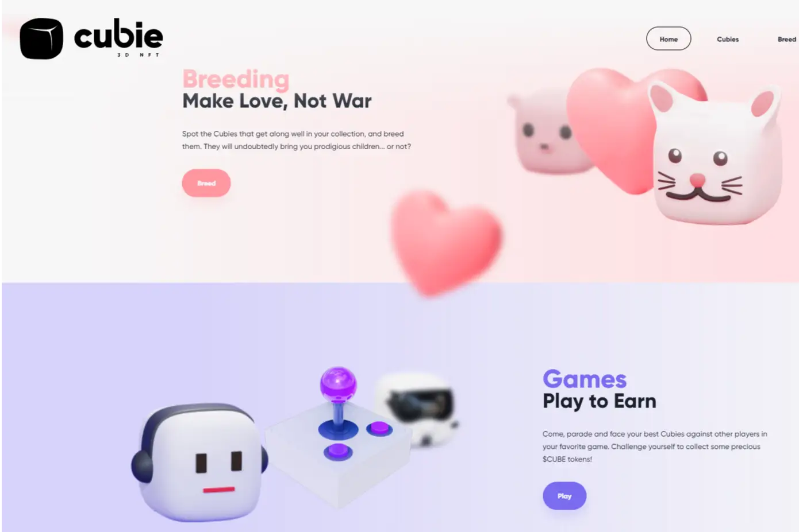

Cubie Minting 在 https://mint.cubie.art/Cubie 是一个社区驱动的 NFT 和 3000 TRX 铸币厂。 Tron 上的 GameFi 项目。探索广泛的 Cubies 系列！普通、独特、稀有、史诗和传奇，它们都很可爱，各有特色。共有 150 个独特的 3D NFT。$CUBE 代币是我们平台的核心，整个项目都是围绕它构建的。所有交易、购买、销售和投注均在 CUBE 中结算。游戏、市场、治理和质押的访问权将专为 CUBE 持有者保留。

