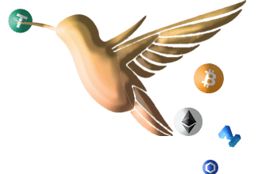

农业起始块：#20880000
链：多边形
预计目标日期：2021 年 11 月 2 日星期二 00:42:49 UTC
没有预售。您只能在 QuickSwap 上购买 CUCKOO
什么是杜鹃？
Cuckoo 是一种去中心化的非托管流动性市场协议，用户可以作为存款人或借款人参与其中。存款人向市场提供流动性以赚取被动收入，而借款人能够以超额抵押（永久）或抵押不足（单块流动性）的方式借款。
为什么选择 KOO？
Cuckoo Finance 是 Polygon 上基于最大的 DeFi 协议 AAVE 之一的借贷市场。
AAVE 已经发展成为该领域最受尊敬和最安全的协议之一，但 Cuckoo 想要以不同的方式做事。 Cuckoo 协议没有治理，也没有 VC，相反，它的特点是在代币持有者和流动性提供者之间赚取代币共享平台费用。该协议将始终不允许每个人在相同的基础上使用。

