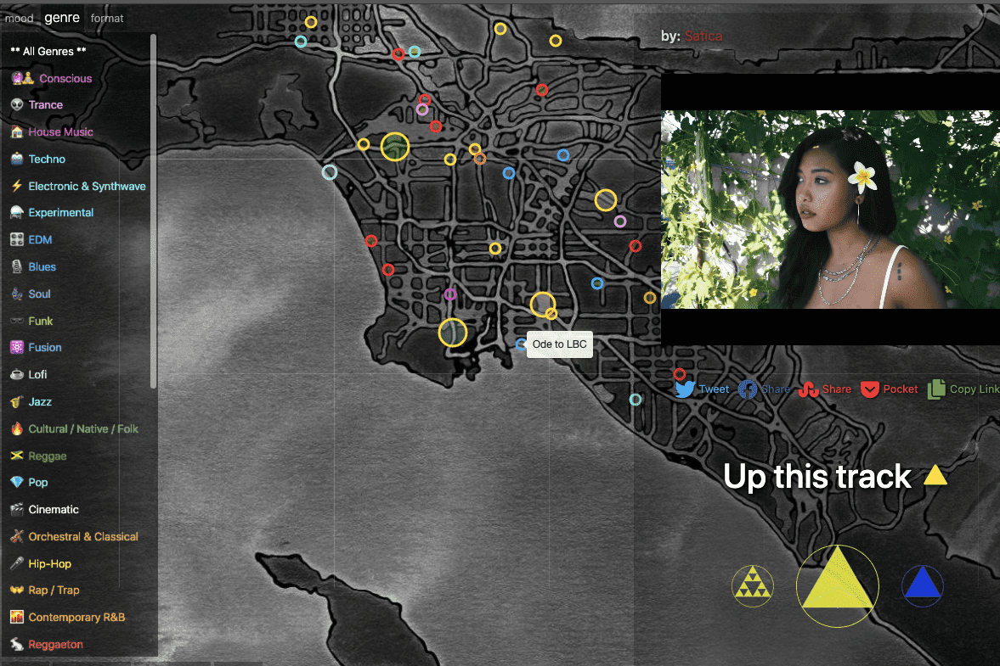

cXc.world (cXc Music) 是一个显示来自世界各地的本地音乐的地图。 On-chain Ups 策划本地排行榜，并奖励参与（Via Ups）的音乐家和听众 BLUX，如果音乐家 PURPLE 进入全球排行榜前 64 位，他们将获得奖励。
音乐显示为绘制灰度地图的彩色圆圈。圆圈的边框颜色显示流派，填充颜色告诉您心情。
按位置搜索以查看那里的热门音乐，并在我们的 Time Machine 中查看发布后的任何时间的热门排行榜，精确到 5 分钟的粒度。
通过双击/点击音乐录制的位置在地图上分享音乐。无论是谁分享了音乐，Youtube 账户的所有者都会开始累积奖励，并在他们在 cXc.world 上链接他们的 WAX 和 Youtube 账户时获得这些奖励。因此，请务必链接到艺术家个人帐户上的视频，而不是发行商上传的视频。
cXc.world (Beta) 在 WAX 区块链上运行
WAX 代币 - Ups 受 🌞 SOL 限制，这是一种可替代的简单资产。 🔵   BLUX 支付给 Sol Up 接收者（艺术家）、听众和模组，也可以用于 Up。      PURPLE 获得 Top Charts 奖励，并且可以每天进行质押 🔵  BLUX。
🧠   在 Github 上的 Purple Explainer 中查看完整的代币经济学
Hive 注意：以前（Alpha）我们在 Hive / Steemit 上，具有自动博客音乐功能。在我们迁移到 cXc.world 上的 Live 后，我们将恢复和改进此功能。 Hive 登录被禁用以避免混淆。

