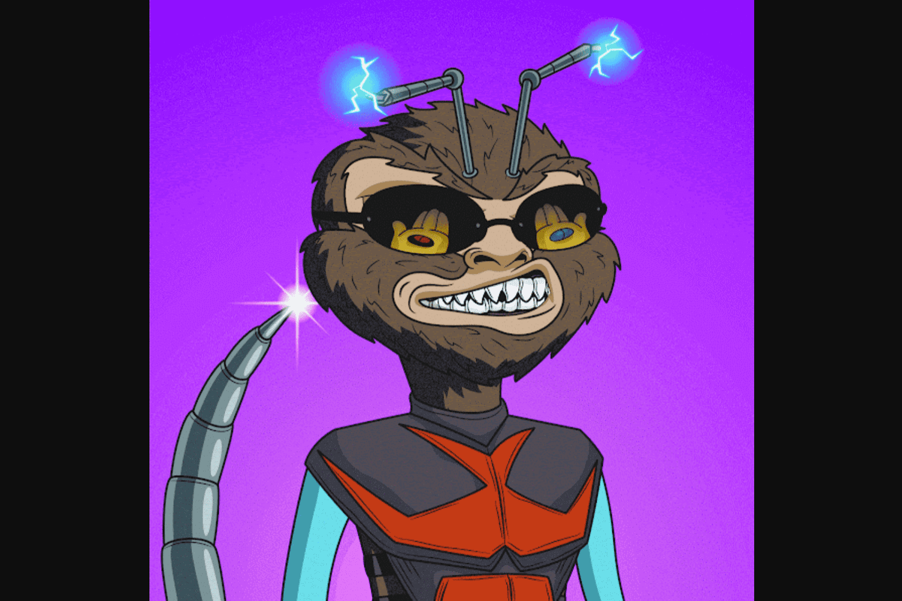

故事、艺术和社区优先。 Cyber​​ Hornets Colony Club 是一个收藏品品牌，拥有 8,888 件独特的 ERC-721 不可替代的代币艺术品 (NFT)，其所有权和真实性的公开证明存储在以太坊区块链上。 Cyber​​ Hornet 艺术作品是从零开始设计的，由 340 多个独特特征随机生成。拥有漫画书风格的 Cyber​​ Hornet 不仅可以让您成为加入我们不断壮大的殖民地的会员，您还可以为所有寻求“大黄蜂生活”的人获得未来福利和大黄蜂殖民地的乐趣。您可以从关注 Cyber​​ Hornet 网站和 Discord 频道开始，并允许对我们不断扩大的群体进行全方位访问。拥有大黄蜂也有分层的好处。拥有 1 只大黄蜂为您提供基本的访问级别，而下一级是拥有 8、24 和 88 只大黄蜂。你不会找到像这样的另一群。网络大黄蜂正在为每个人使用 0.08 ETH 的公平定价模型。会员资格以相同的价格开始，每个钱包最多允许铸造 8 个黄蜂。

