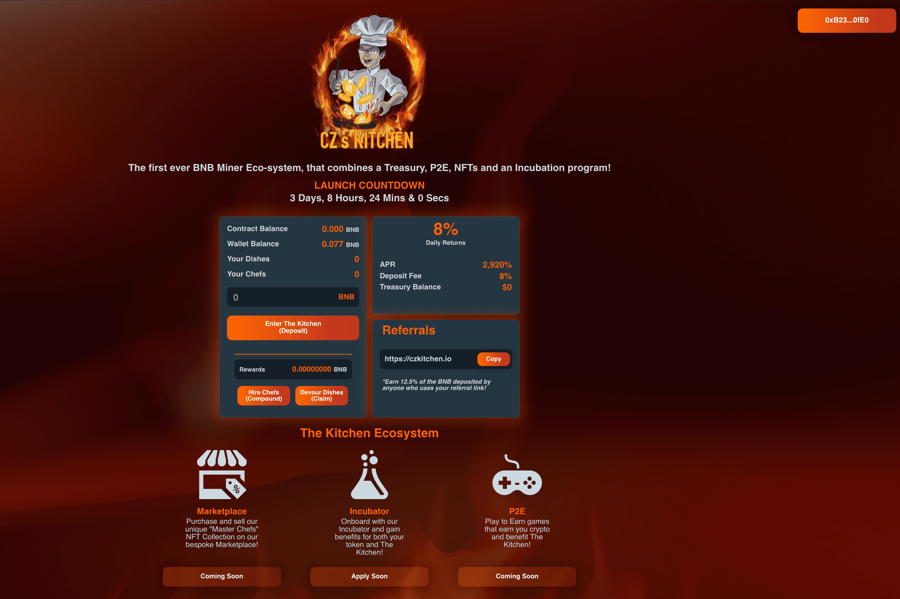

亲爱的厨师们，欢迎来到 CZ 的厨房🧑‍🍳，
围绕矿工协议构建的最具创新性的生态系统。
矿工最近很火，CZ的厨房会是最火的🚀
它是第一个结合 Miner、Treasury、P2E、NFT 和孵化服务的生态系统😱🔥
整个生态系统是以这样的方式构建的，它将产生足够的外部收入来反馈矿工协议并使其长期维持🤑🔥
目标很简单 - 终极被动收入协议，仅此而已 💯
CZ’s Kitchen 拥有一个成功项目所需的一切：
✅经验丰富且透明的团队
✅为已被证明行之有效并深受许多人喜爱的商业模式带来创新
✅一流的营销策略。 “你在营销方面有什么？”坐下来看看😉
✅专注于与已经证明的项目建立伙伴关系和联系。
💰2920% APR ~ 高达每天 8%。
💰12.5% 美味推荐和复合奖金！！

